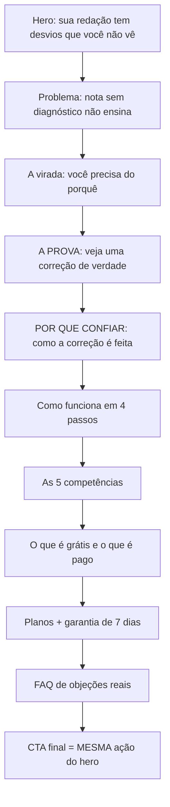

# 📑 Estrutura de Copywriting & Landing de Vendas (`/`)

> [!warning] **Esta nota estava descrevendo uma página que não existia mais**
> Até 18/09 ela registrava 3 planos (R$29,90 / R$89 / R$147), checkout no Stripe e um fluxo "sem conta/login". Nada disso vale: os planos viraram 2 no ADR 026, o gateway virou Kiwify no ADR 028, e o login real existe desde o ADR 011. Reescrita para bater com `src/app/page.tsx`.

> [!tip] **Diretriz de Comunicação**
> Copy sóbria. Nenhuma promessa de nota garantida, nenhum depoimento inventado, nenhum número de alunos que não exista. A prova vem de **mostrar o produto**, não de afirmar que ele é bom.

---

## 🎯 O argumento da página, do topo ao rodapé

A ordem das seções **é** o argumento. Cada uma responde a objeção que a anterior levanta:

> [!danger] **A incoerência que foi corrigida no ADR 043**
> Todo CTA dizia **"CORRIGIR MINHA REDAÇÃO"** e chamava `scrollToPricing()`. Quem clicava pedindo para corrigir recebia uma tabela de preços — a quebra de promessa acontecia no primeiro clique, antes de qualquer argumento ter sido feito. Hoje o botão faz o que diz: leva para a correção gratuita.

---

## 🆓 A oferta que estava escondida

O produto dá **1 correção gratuita** por conta (`LIMITE_CORRECOES_GRATUITAS`, `src/lib/limites.ts` — era 3 até 18/09, ver ADR 044) e `/nova-redacao` nunca exigiu assinatura — só `RequerLogin`. A landing não mencionava isso em lugar nenhum. A prova de valor mais forte do produto estava construída e invisível.

> [!important] **A fronteira, dita antes do preço e não depois**

| Grátis (primeira redação) | Com plano |
| :--- | :--- |
| A redação corrigida pelos critérios do INEP | A nota de cada uma das 5 competências |
| **Quantos desvios** o texto tem | Cada desvio marcado no texto, com o motivo |
| Alerta se a redação seria anulada | Versão reescrita |
| Sem pedir cartão | Plano de ação para a próxima redação |
| | Gráfico de evolução entre redações |

O gratuito entrega o **veredito**, não o diagnóstico — é a RLS de `correcoes` que segura o resto (ADR 013). Dizer isso na página é decisão deliberada: omitir a fronteira até depois do pagamento gera sensação de engano, e reembolso/chargeback custam mais caro do que a venda que a omissão traria.

---

## 📝 Texto por seção (o que está no ar)

### 1. Hero
> **"Sua redação tem desvios que você não está enxergando"**
>
> *"Envie sua redação agora e descubra em segundos quantos pontos de atenção ela tem, pelos critérios oficiais do ENEM. A primeira é gratuita e não pedimos cartão."*
>
> CTA: **CORRIGIR MINHA REDAÇÃO DE GRAÇA →** · link secundário: *"Antes, ver um exemplo de correção"*
>
> Selos: ✓ Sem cartão · ✓ Resultado em segundos · ✓ Critérios oficiais do INEP
>
> Rodapé do hero: *"Sem promessa de nota garantida. O objetivo é transformar cada redação em aprendizado."*

### 2. O problema
Quatro cartões com a dor real da persona: recebe nota sem entender o motivo, repete os mesmos erros, não sabe qual competência a segura, espera demais por correção.

### 3. A virada
> **"Nota sem diagnóstico não ensina."** → *"É isso que o Nota 1000 entrega."* → *"E você não precisa acreditar na nossa palavra — role e veja uma correção de verdade."*

Essa última linha é a ponte para a prova. Sem ela, a seção é só mais uma afirmação.

### 4. A PROVA (`#exemplo`)
`src/components/vendas/ExemploCorrecao.tsx` — a seção que a página não tinha.

Mostra nota geral (840/1000), as 5 competências com barra, um trecho de texto com dois desvios **marcados** (concordância verbal e coesão), o comentário do corretor ao lado de cada um, e o bloco "Seu próximo passo".

> [!info] **Usa as MESMAS classes do produto** (`highlight-concordancia`, `highlight-coesao`, de `globals.css` — as mesmas que `TextoDestacado` aplica na correção real), não uma imitação. O riscado do corretor e a superfície do texto são utilitários Tailwind, e não as antigas `.risco-corretor`/`.bloco-pautado`, removidas no ADR 035. Se o visual da correção mudar, a demonstração muda junto — demonstração que envelhece separada do produto vira promessa falsa.
>
> O conteúdo é **ilustrativo**, escrito para a demonstração e rotulado como exemplo na tela. Não é redação de aluno real.

### 4b. POR QUE CONFIAR (`#rigor`)
`src/components/vendas/RigorDaCorrecao.tsx`. Vem logo depois da prova, de propósito: a pessoa acabou de ver o resultado, e a pergunta seguinte é se dá para acreditar nele.

**Por que esta seção existe**: concorrentes como coRedação e SPES anunciam correção gratuita ilimitada. Competir por "quanto de graça" é disputa perdida — o que dá para defender é **como** a correção é feita.

> [!danger] **Regra desta seção: nada de superlativo comparativo**
> Nenhuma frase pode dizer "o mais preciso" ou "melhor que os outros". Ninguém mediu isso contra a concorrência, e afirmar seria inventar. Cada um dos quatro pilares descreve um **mecanismo que existe no código e pode ser conferido**:

| Afirmação na página | Onde está no código |
| :--- | :--- |
| Duas correções independentes, e uma terceira se divergirem mais de 100 pontos | `reconciliarCorrecoes` e `LIMIAR_DIVERGENCIA` (`src/lib/reconciliacao.ts`) |
| Erro cujo trecho não existe no texto é descartado | `validarCorrecaoIA` (`src/lib/correcao-schema.ts`) |
| Os 5 elementos da C5 conferidos contra a nota | `ElementosC5Schema` + regra de consistência de C5 |
| Divergência de anulação resolvida a favor do aluno | ramo `a.anulada !== b.anulada` de `reconciliarCorrecoes` |

A dupla correção leva selo **"Com plano"**: a correção gratuita roda uma passagem só (`corrigirRedacaoSimples`). Omitir isso criaria a expectativa de receber de graça algo que a rota não entrega — a mesma quebra de promessa que o ADR 043 tirou da página.

Fecha com um parágrafo que **limita a própria promessa**: nada disso torna a correção infalível, e nenhuma nota aqui é a nota oficial do INEP. Dizer isso na própria seção de rigor é o que a mantém crível.

### 5. Como funciona (4 passos)
1. **Crie sua conta** — menos de um minuto, libera as 3 gratuitas, não pedimos cartão.
2. **Envie sua redação** — editor ou arquivo PDF/Word/TXT.
3. **Veja quantos desvios tem** — em segundos, e se seria anulada.
4. **Abra o diagnóstico** — com plano ativo: nota por competência, desvios marcados, o que fazer na próxima.

### 6. As 5 competências
Cada uma vale até 200 pontos. O enquadramento é de estudo, não de recurso: *"saber qual delas está te segurando é o que decide onde vale a pena gastar seu tempo"*.

### 7. Oferta / Preço (`#planos`)
> **"Depois das gratuitas, escolha como continuar."**

| Plano | Preço | Acesso | Observação |
| :--- | :--- | :--- | :--- |
| **Plano Mensal** (mais escolhido) | R$ 97/mês | 30 dias, renova | Assinatura recorrente na Kiwify |
| **Acesso 30 dias** | R$ 147 | 30 dias, não renova | Pagamento único |

Preços vêm de `PLANOS.precoReais` (`src/lib/planos.ts`) — fonte única, lida também pelo webhook e pelo valor mandado ao Meta. **Precisa bater com o painel da Kiwify**; divergência não dá erro em lugar nenhum, só quebra a identificação de plano e o ROAS, em silêncio.

- **Garantia de 7 dias**, reembolso integral sem justificativa.
- **Linha de resgate** logo abaixo: *"Já comprou e o acesso não liberou? Destrave sua compra aqui"* → `/vincular-compra` (ADR 040).

### 8. FAQ (objeções reais, nesta ordem)
1. *A correção grátis é de verdade? Precisa de cartão?* — **primeira de propósito**: é a objeção de quem chega por anúncio.
2. *A avaliação segue os critérios reais do ENEM?*
3. *Quanto tempo leva?*
4. *Como recebo o acesso após a compra?* — cita `/vincular-compra`.
5. *Posso enviar em arquivo?*
6. *E se eu assinar e não gostar?*

### 9. CTA final
**A mesma ação do hero**, de propósito — a página fecha a promessa que abriu.
> *"Envie a redação que você escreveu essa semana e descubra quantos desvios ela tem. Se o diagnóstico te ajudar, aí sim a gente conversa sobre plano."*

### 10. Rodapé
Identificação do produto, link para a Política de Privacidade e contato do suporte.

---

## 📊 O que a página mede

| Momento | Evento Meta | Evento GA4 |
| :--- | :--- | :--- |
| Carregou a landing | `ViewContent` | `view_item` |
| Criou conta | `CompleteRegistration` | `sign_up` |
| Enviou redação | `Lead` | `generate_lead` |
| Clicou para pagar | `InitiateCheckout` | `begin_checkout` |
| Pagamento confirmado | `Purchase` (**servidor**) | — |

A compra sai pelo servidor porque o checkout roda no domínio da Kiwify e o pixel do navegador nunca vê a venda. Ver ADR 042 e [[05 - Banco de Dados & Integrações/Supabase, Storage & Env|a tabela `atribuicao_anuncio`]].

---

## 🔗 Links Relacionados
- [[01 - Visão Geral & Negócio/Persona & Dores dos Vestibulandos|Persona: para quem esta copy fala]]
- [[04 - Arquitetura Técnica/Stack & Estrutura de Rotas|A landing no mapa de rotas]]
- [[06 - Registro de Decisões/Decisões de Arquitetura & Changelog|ADR 026 (2 planos), 028 (Kiwify), 033 (resgate), 035 (medição), 036 (prova de valor)]]
- [[00 - Índice Principal|Retornar ao Índice Principal]]
