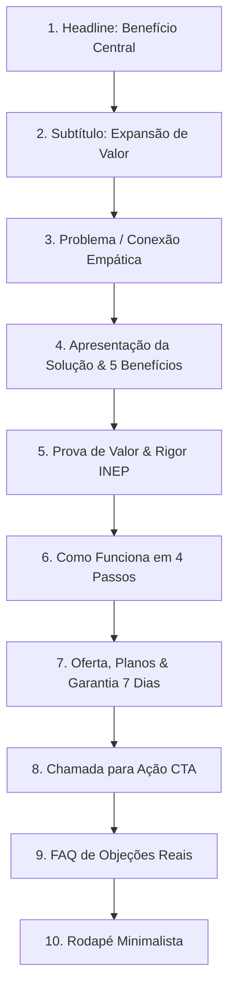

# 📑 Estrutura de Copywriting & Página de Vendas (`/vendas`)

> [!tip] **Diretriz de Comunicação**
> A página de vendas `/vendas` adota um tom sóbrio, humano, transparente e focado em clareza, eliminando clichês de infoproduto e mantendo foco no benefício real para o vestibulando.

> [!warning] **Não é mais independente do produto — acesso é bloqueado até pagar**
> Até 2026-09-05, os botões de `/vendas` levavam direto para `/nova-redacao` sem nenhuma verificação, tornando a página apenas decorativa. Isso foi corrigido: os 3 planos agora criam uma sessão real do Stripe Checkout, e `/nova-redacao`, `/dashboard`, `/historico` e `/correcao/[id]` verificam assinatura ativa antes de renderizar (componente `RequerAssinatura`), redirecionando para `/vendas` quando não há pagamento confirmado. Ver [[06 - Registro de Decisões/Decisões de Arquitetura & Changelog|ADR 010]] e [[05 - Banco de Dados & Integrações/Supabase, Storage & Env|Supabase, Storage & Env]].

---

## 🏗️ Estrutura Obrigatória da Página de Vendas

---

## 📝 Texto Completo por Seção

### 1. Headline (Título Principal)
> **"Garanta mais de 900 pontos na redação do ENEM com correções imediatas."**

### 2. Subtítulo
> *"Receba avaliações detalhadas pelas 5 competências oficiais em segundos, com marcação exata dos erros e versão reescrita sugerida para o seu tema."*

### 3. Problema / Conexão
> Praticar redação com frequência é o único caminho para alcançar uma nota competitiva no ENEM. No entanto, o modelo tradicional de correção cria barreiras que atrasam a sua evolução.  
> Na maioria dos cursinhos e plataformas, o estudante envia um texto e precisa esperar de 10 a 20 dias para receber o retorno. Quando a folha é devolvida, a linha de raciocínio daquele tema já foi esquecida, e os comentários costumam ser vagos: anotações como "melhore a coesão" ou "repertório insuficiente", sem indicar como reescrever.  
> Sem um feedback imediato e transparente sobre cada uma das 5 competências, o estudante continua repetindo os mesmos desvios gramaticais e falhas na proposta de intervenção sem perceber.

### 4. Apresentação da Solução
> O Avaliador Nota 1000 foi estruturado para fornecer o suporte técnico e pedagógico que você precisa para escrever com segurança:
> 1. **Correção em menos de 10 segundos**: Envie sua redação e receba o diagnóstico completo na hora, permitindo corrigir o texto e produzir uma nova versão no mesmo dia.
> 2. **Critérios oficiais do INEP (C1 a C5)**: Avaliação detalhada com notas de 0 a 200 pontos em cada competência.
> 3. **Marcação de erros linha por linha**: Cada desvio de concordância, pontuação, regência ou conectivo é destacado no texto com a justificativa e a reescrita sugerida.
> 4. **Auditoria completa da Competência 5**: Checagem rigorosa dos 5 elementos da proposta de intervenção (Agente, Ação, Meio, Efeito e Detalhamento).
> 5. **Versão reescrita no padrão nota 1000**: O sistema reconstrói os seus próprios argumentos em um modelo exemplar de nota máxima.

### 5. Prova de Valor e Confiança
> - Avaliação 100% orientada pelas diretrizes públicas do Manual de Corretores do INEP.
> - Diagnóstico transparente com demonstração linha por linha e identificação de regras gramaticais e de coesão.

### 6. Como Funciona (Fluxo Real)
1. **Passo 1 — Escolha seu plano**: Selecione o período de acesso ideal para o seu cronograma de estudos.
2. **Passo 2 — Pagamento no Stripe Checkout**: Redirecionado para a página segura do Stripe; ao confirmar, o webhook libera o acesso automaticamente no mesmo navegador (sem conta/login — ver limitação de auth em [[06 - Registro de Decisões/Decisões de Arquitetura & Changelog]]).
3. **Passo 3 — Envie sua redação**: Digite direto no editor ou faça upload do seu arquivo em PDF, Word ou texto.
4. **Passo 4 — Receba o relatório**: Veja a nota, as marcações de erro e a versão nota 1000 em menos de 10 segundos.

### 7. Oferta / Preço
- **Plano Anual (Até o ENEM)**: 12x de R$ 14,90 (ou R$ 147,00 à vista) — Acesso ilimitado e completo.
- **Plano Semestral**: R$ 89,00 à vista — 6 meses de acesso.
- **Plano Mensal**: R$ 29,90 / mês — Renovação mensal, cancele quando quiser.
- **Garantia de 7 dias**: Teste por 7 dias; se não atender às expectativas, reembolso de 100% sem burocracia.

### 8. Chamada para Ação (CTA)
> Botão: **"Garantir Acesso ao Avaliador"** (Posicionado após a oferta e no fechamento da página).

### 9. Perguntas Frequentes (FAQ)
- *A avaliação segue os critérios reais do ENEM?*
- *Quanto tempo leva para a redação ser corrigida?*
- *Como recebo o acesso após a compra?*
- *Posso enviar redações em arquivo ou apenas digitando?*

### 10. Rodapé
> Sóbrio, contendo informações de contato do suporte, garantia de 7 dias e identificação do produto.

---

## 🔗 Links Relacionados
- [[04 - Arquitetura Técnica/Stack & Estrutura de Rotas|Rota /vendas no Next.js]]
- [[02 - Metodologia ENEM/Matriz Oficial do INEP|Matriz de Avaliação do INEP]]
