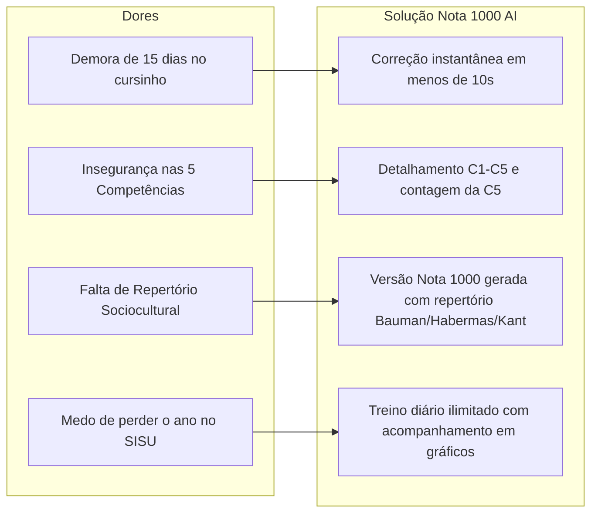

# 🧠 Persona & Dores Críticas dos Vestibulandos

> [!danger] **O Principal Medo do Vestibulando**
> Passar 10 a 12 meses estudando 8 horas por dia matemática, física, biologia e história, tirar notas altas na prova objetiva e **ser reprovado na Universidade Pública por causa de uma nota 640 na Redação do ENEM**.

---

## 🎯 Perfil da Persona

| Atributo | Detalhe |
| :--- | :--- |
| **Nome Fictício** | Lucas / Mariana (17 a 22 anos) |
| **Objetivo Principal** | Conquistar vaga em Universidade Pública (SISU / ProUni / FIES) em cursos como Medicina, Direito, Odontologia ou Engenharias. |
| **Nível Atual na Redação** | Estagnado entre 600 e 760 pontos há mais de 6 meses. |
| **Rotina** | Estuda o dia todo em cursinho ou escola, sente-se sobrecarregado e com pouco tempo para treinar redação. |
| **Sentimento Dominante** | Ansiedade pelo tempo passando, insegurança sobre o que a banca espera e frustração com correções lentas e genéricas. |

---

## 🩸 As 5 Dores Críticas (Gatilhos Emocionais)

### 1. O Terror do Peso da Redação no SISU
Em quase todas as universidades federais (UFRJ, UFMG, USP, UFC, UFPR), a redação tem **peso 3, 4 ou 5**. Uma diferença de 120 pontos na redação pode jogar a média ponderada do candidato de 780 para 710, destruindo qualquer chance de aprovação.

### 2. A "Farsa" dos Cursinhos Tradicionais
- **Demora Excessiva**: O cursinho promete "redações corrigidas", mas o aluno entrega o texto e espera de **15 a 21 dias úteis** para receber de volta. Quando recebe, já nem lembra o que pensou ao escrever.
- **Correções Superficiais e Ilegíveis**: Comentários à caneta como *"melhore o repertório"*, *"falta coesão"* ou *"cuidado com a concordância"*, sem ensinar o que fazer nem onde reescrever.
- **Limite Rígido**: Cursinhos limitam a 2 ou 4 redações por mês. Para treinar mais, cobram taxas extras abusivas.

### 3. O "Trauma da Folha em Branco" e a Angústia do Tema
O vestibulando senta para escrever e passa **mais de 1 hora travado no primeiro parágrafo**, sem saber:
- Qual repertório sociocultural citar;
- Como articular a tese de maneira crítica sem ser mero resumo;
- Como transitar entre parágrafos sem parecer repetitivo.

### 4. A Pegadinha Mortal da Competência 5 (Intervenção)
A Competência 5 vale **200 pontos inteiros** e exige estritamente 5 elementos:
1. **Agente** (Quem fará?)
2. **Ação** (O que será feito?)
3. **Modo/Meio** (Como será feito?)
4. **Efeito/Finalidade** (Para que servirá?)
5. **Detalhamento** (Aprofundamento de um dos quatro anteriores).
Se o vestibulando esquecer o *detalhamento*, sua nota cai de 200 para 160. Se esquecer o *efeito*, cai para 120. Uma perda de 80 pontos por um detalhe técnico bobo.

### 5. Desvios Gramaticais Ocultos na Competência 1
Muitos estudantes acham que escrevem bem, mas cometem erros que a banca pune impiedosamente:
- Falta do acento circunflexo diferencial (*"eles tem"* em vez de *"eles têm"*);
- Vírgula separando sujeito e predicado;
- Paralelismo sintático quebrado;
- Crase incorreta antes de palavras masculinas ou verbos.

---

## 💡 Como a Plataforma Responde a Cada Dor

---

## 🔗 Links Relacionados
- [[01 - Visão Geral & Negócio/Estratégia de Vendas & Copywriting|Copywriting e Gatilhos da Página de Vendas /vendas]]
- [[02 - Metodologia ENEM/Matriz Oficial do INEP|Matriz de Avaliação do INEP]]
- [[02 - Metodologia ENEM/Competências Detalhadas C1 a C5|Como a C5 e C1 são Avaliadas]]
