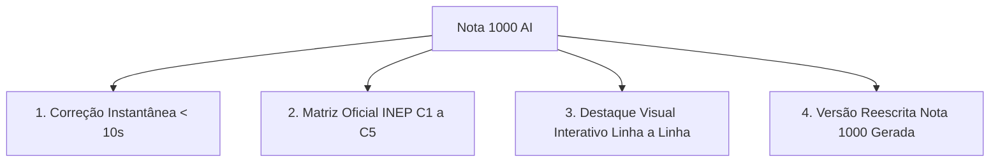

# 🚀 Visão Geral do Produto & Proposta de Valor

> **Projeto**: Nota 1000 AI  
> **Propósito**: Democratizar o acesso a correções de redação de nível de excelência máxima, eliminando o tempo de espera de semanas dos cursinhos tradicionais e fornecendo diagnóstico cirúrgico em menos de 10 segundos com a matriz oficial do INEP.

---

## 🎯 A Grande Promessa (Unique Selling Proposition - USP)
"Permitir que qualquer vestibulando saia de notas medianas (600-700) e alcance mais de **900 pontos no ENEM**, treinando com um corretor de inteligência artificial rigoroso, didático e instantâneo, pagando uma fração do valor de cursinhos tradicionais."

---

## 💡 Os 4 Pilares da Solução

### 1. Velocidade de Feedback Imediato ($< 10$ segundos)
O aprendizado de escrita requer iteração em tempo real. Quando o aluno escreve uma redação, sua linha de raciocínio está fresca. Esperar 15 a 20 dias (como nos cursinhos) inutiliza o ciclo pedagógico. No **Nota 1000 AI**, o aluno envia e recebe o diagnóstico em segundos.

### 2. Rigor Baseado na Matriz Oficial do INEP
A IA não faz elogios vazios ou comentários genéricos como "bom texto". Ela segue a grade oficial de 0 a 200 pontos nas 5 competências:
- **C1**: Norma culta e gramática.
- **C2**: Compreensão do tema e repertório sociocultural produtivo.
- **C3**: Projeto de texto, tese e coerência argumentativa.
- **C4**: Mecanismos de coesão inter e intraparágrafos.
- **C5**: Proposta de intervenção com checagem dos 5 elementos (Agente, Ação, Meio, Efeito, Detalhamento).

### 3. Diagnóstico Cirúrgico & Marcação Visual
Erros são categorizados por cor (`highlight-gramatica`, `highlight-coesao`, `highlight-concordancia`, etc.) sobre o próprio texto digitado ou importado via PDF/DOCX/TXT. Ao clicar no trecho, o aluno vê o porquê daquele desvio e a sugestão de correção.

### 4. Versão Reescrita Nota 1000 Personalizada
Para cada redação enviada, o modelo gera uma versão reescrita nota 1000 mantendo a ideia original do aluno, mas elevando a norma culta, inserindo repertório legitimado e blindando os 5 elementos da proposta de intervenção.

---

## 👥 Público-Alvo
1. **Vestibulandos de Cursos de Alta Concorrência** (Medicina, Direito, Engenharia, Psicologia, Odontologia) onde a redação possui peso de até 50% na nota do SISU.
2. **Estudantes de Escola Pública** que não têm acesso a corretores particulares ou cursinhos de elite.
3. **Alunos de Cursinho Tradicional** frustrados com o limite de 2 a 4 redações/mês e com a demora de até 3 semanas para devolução.
4. **Treineiros e Alunos do 1º ao 3º Ano do Ensino Médio** que buscam construir repertório com antecedência.

---

## 🔗 Links Relacionados
- [[01 - Visão Geral & Negócio/Persona & Dores dos Vestibulandos|Dores Profundas da Persona & Análise do SISU]]
- [[01 - Visão Geral & Negócio/Estratégia de Vendas & Copywriting|Estratégia da Página de Vendas /vendas]]
- [[02 - Metodologia ENEM/Matriz Oficial do INEP|Matriz de Correção Oficial do INEP]]
- [[03 - Inteligência Artificial/Arquitetura de IA & Prompts|Engenharia de Prompt e Modelos de IA]]
