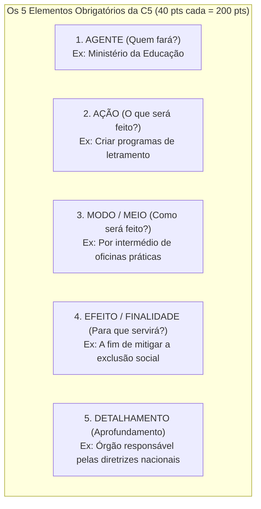

# 🔍 Detalhamento Profundo das 5 Competências do ENEM

> [!tip] **Guia Pedagógico do Corretor**
> Esta nota detalha as regras minuciosas que o motor de Inteligência Artificial do **Nota 1000 AI** utiliza para auditar e pontuar cada competência.

---

## 📘 Competência 1: Domínio da Norma Culta da Língua Escrita
Avalia a precisão gramatical, ortográfica, sintática e o registro formal.

### Critérios de Pontuação:
- **200 pts**: Excelente domínio; no máximo 2 desvios gramaticais leves e 1 falha de estrutura sintática que não comprometem o texto.
- **160 pts**: Bom domínio; poucos desvios gramaticais e poucas falhas de estrutura.
- **120 pts**: Domínio mediano; desvios frequentes ou problemas recorrentes de pontuação/concordância.
- **80 pts**: Domínio insuficiente; muitos erros que prejudicam a fluidez da leitura.
- **40 pts**: Domínio precário; erros graves sistemáticos.
- **0 pts**: Desconhecimento da norma culta.

### Principais Erros Auditados pela IA:
- `concordancia`: Nominal e verbal (*ex: "os alunos tem" $\rightarrow$ "têm"*).
- `regencia`: Verbal e nominal (*ex: "assistir o filme" $\rightarrow$ "assistir ao filme"*).
- `pontuacao`: Vírgula separando sujeito de predicado ou oração principal de subordinada substantiva.
- `ortografia`: Uso incorreto de s/z, ç, x/ch, hifens e acentuação gráfica.

---

## 📗 Competência 2: Tema, Tipo Textual & Repertório Sociocultural
Avalia a compreensão integral da frase-tema, a obediência ao gênero dissertativo-argumentativo e a legitimação de repertório sociocultural.

### Critérios de Pontuação:
- **200 pts**: Tema desenvolvido com consistência argumentativa + repertório legitimado (filosofia, sociologia, literatura, história, dados científicos) **pertinente e produtivo** ao argumento.
- **160 pts**: Bom desenvolvimento com repertório legítimo, porém com articulação apenas mediana com a tese.
- **120 pts**: Desenvolvimento mediano; repertório baseado quase exclusivamente nos textos motivadores ou desarticulado.
- **80 pts**: Tangenciamento do tema ou repertório ausente.
- **40 pts**: Fuga parcial do tema ou traços de outros gêneros textuais.
- **0 pts**: Fuga total ao tema ou não atendimento ao gênero.

---

## 📙 Competência 3: Projeto de Texto & Argumentação Consistente
Avalia se os argumentos foram planejados estrategicamente, com autoria e progressão temática lógica.

### Critérios de Pontuação:
- **200 pts**: Projeto de texto estratégico e coeso; introdução com tese explícita em 2 eixos ($D1$ e $D2$), desenvolvimentos consistentes sem contradições e conclusão harmônica.
- **160 pts**: Projeto de texto claro, com pequenas falhas de progressão ou desenvolvimento parcial de um argumento.
- **120 pts**: Argumentos pouco desenvolvidos, repetitivos ou puramente expositivos (sem defesa contundente de ponto de vista).
- **80 pts**: Argumentação desordenada, desconexa ou contraditória.
- **40 pts**: Traços quase nulos de projeto de texto.
- **0 pts**: Ausência de defesa coerente de ideias.

---

## 📒 Competência 4: Mecanismos Linguísticos (Coesão Textual)
Avalia o encadeamento textual, diversidade de conectivos e ausência de repetições vocabulares.

### Critérios de Pontuação:
- **200 pts**: Articulação excelente; presença obrigatória de **conectivos interparágrafos** (no início de pelo menos 2 parágrafos do texto, como *"Em primeiro plano"*, *"Ademais"*, *"Portanto"*) e conectivos **intraparágrafos** diversificados.
- **160 pts**: Boa coesão; pequenas repetições ou uso pontual inadequado de operadores argumentativos.
- **120 pts**: Coesão mediana; uso repetitivo de conectivos simples (*"e"*, *"mas"*, *"porque"*) e parágrafos truncados.
- **80 pts**: Articulação insuficiente; texto fragmentado em frases soltas (*fraseamento monótono*).
- **40 pts**: Articulação precária.
- **0 pts**: Ausência total de coesão.

---

## 📕 Competência 5: Proposta de Intervenção (Os 5 Elementos)
Avalia a elaboração de uma intervenção detalhada para o problema discutido, com pleno respeito aos Direitos Humanos.

### Grade de Pontuação da C5:
| Elementos Presentes | Pontuação Atribuída |
| :--- | :--- |
| **5 elementos completos** | **200 pts** |
| 4 elementos | 160 pts |
| 3 elementos | 120 pts |
| 2 elementos | 80 pts |
| 1 elemento | 40 pts |
| Proposta ausente / Desconexa | 0 pts |
| *Violação aos Direitos Humanos* | *Nota 0 na C5 automaticamente* |

---

## 🔗 Links Relacionados
- [[02 - Metodologia ENEM/Matriz Oficial do INEP|Visão Geral da Matriz do INEP]]
- [[03 - Inteligência Artificial/Arquitetura de IA & Prompts|Implementação dos Critérios no Prompt]]
- [[04 - Arquitetura Técnica/Componentes & Design System|Visualização no Componente CorrecaoView]]
