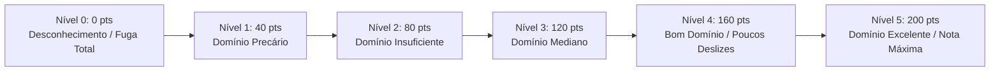

# 📜 Matriz Oficial do INEP — Correção da Redação do ENEM

> [!info] **Estrutura de Pontuação Oficial**
> A redação do ENEM é avaliada por **5 competências**, variando de **0 a 200 pontos** cada (em intervalos de 40 pontos: 0, 40, 80, 120, 160 e 200), totalizando uma nota final entre **0 e 1000 pontos**.

---

## 📊 Visão Geral das 5 Competências

| Competência | Foco de Avaliação | Nota Máx. |
| :--- | :--- | :--- |
| **Competência 1 (C1)** | Norma culta da língua escrita, ortografia, pontuação, crase, concordância e regência. | 200 pts |
| **Competência 2 (C2)** | Compreensão do tema, tipo dissertativo-argumentativo e repertório sociocultural produtivo. | 200 pts |
| **Competência 3 (C3)** | Seleção, relação, organização e interpretação de informações, tese e projeto de texto. | 200 pts |
| **Competência 4 (C4)** | Mecanismos linguísticos de coesão, conectivos inter e intraparágrafos sem repetições. | 200 pts |
| **Competência 5 (C5)** | Proposta de intervenção social para o problema com os 5 elementos obrigatórios. | 200 pts |
| **TOTAL** | **Soma das 5 competências** | **1000 pts** |

---

## 🎯 Escala Oficial de Níveis por Competência (0 a 200)

---

## 🚫 Critérios de Nota Zero (Anulação Direta)
A redação recebe nota zero absoluta no ENEM se apresentar:
1. **Fuga total ao tema** proposto;
2. **Não atendimento à estrutura dissertativo-argumentativa** (ex: poema, carta, narrativa);
3. **Texto com menos de 7 linhas escritas**;
4. **Cópia integral dos textos motivadores** da proposta;
5. **Desenhos, impropérios, trechos deliberadamente desconexos** ou assinatura fora do local designado;
6. **Folha de redação em branco**.

---

## 🔗 Links Relacionados
- [[02 - Metodologia ENEM/Competências Detalhadas C1 a C5|Detalhamento Profundo de C1, C2, C3, C4 e C5]]
- [[03 - Inteligência Artificial/Arquitetura de IA & Prompts|Injeção da Matriz no System Prompt da IA]]
- [[04 - Arquitetura Técnica/APIs, Modelos & Tipagem|Tipos TypeScript: CompetenciaNumero, ErroIdentificado]]
