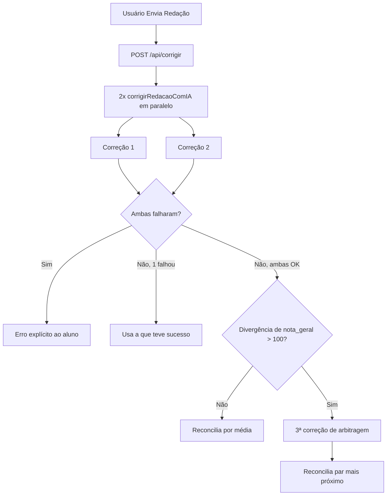

# 🤖 Arquitetura de IA & Engenharia de Prompts

> [!warning] **Sem fallback heurístico — nunca fabricar resultado**
> O antigo "motor heurístico offline" foi removido. Se Gemini e OpenAI falham, `corrigirRedacaoComIA` lança erro explícito — o aluno vê uma falha honesta, nunca uma nota inventada. Ver [[06 - Registro de Decisões/Decisões de Arquitetura & Changelog|ADR 005]].

> [!tip] **Dupla correção com reconciliação**
> Réplica do protocolo oficial do ENEM (dois corretores + arbitro em caso de divergência). Ver [[06 - Registro de Decisões/Decisões de Arquitetura & Changelog|ADR 006]].

---

## 🔄 Fluxo de Processamento (`corrigirRedacaoComDuplaCorrecao`)

Cada `corrigirRedacaoComIA` individual: Gemini 3.6 Flash (3 retries, backoff exponencial, temp 0.1) → OpenAI gpt-4o-mini (2 retries, temp 0.2, `max_tokens: 6000`) → lança erro.

- **Motivo da dupla correção**: variação real medida de até 120 pontos na mesma redação entre execuções (não-determinismo do LLM).
- **Limiar de divergência**: 100 pontos (`LIMIAR_DIVERGENCIA` em `src/lib/reconciliacao.ts`).
- Se a 3ª correção também falhar, reconcilia com o par divergente mesmo assim (nunca falha a correção inteira por causa da arbitragem).

---

## 🔒 Regras de Consistência (validador, não só o prompt)

O modelo pode se autocontradizer em texto livre — por isso `correcao-schema.ts` trava a resposta contra fatos estruturais, não apenas confia no prompt:

| Regra | Trava |
| :--- | :--- |
| Soma das competências | Deve bater exatamente com `nota_geral` |
| Nível de cada competência | `nivel === nota / 40` |
| Anulação total | Fuga de tema, tipo textual errado, texto <7 linhas, cópia de motivadores → `nota_geral = 0`, todas competências = 0 |
| C2 monobloco | Parágrafos reais ≤1 → nota de C2 ≤80 (contagem real injetada no prompt, IA não pode inferir estrutura que não existe) |
| C5 (`elementos_c5`) | Agente/Ação/Meio/Efeito/Detalhamento como booleanos — 4-5 presentes ⇒ nota ≥160; 0 presentes ⇒ nota = 0 |
| C1/C3/C4 (`habilidades_c1/c3/c4`) | Idem: 4/4 habilidades ⇒ nota ≥160; 0/4 ⇒ nota ≤80 |
| Grounding de `erros[]` | Todo `trecho` citado deve existir literalmente no texto do aluno — senão é descartado com aviso |
| C1 cross-check | Nota 200 com ≥2 erros gramaticais citados (competência 1) é rejeitada |

Padrão usado: **autorrelato estruturado + trava do validador** — pedir campos booleanos discretos em vez de só prosa livre, e validar consistência numérica contra eles depois do parse.

---

## 📜 System Prompt (`src/lib/prompt-agente.ts`)

Seções principais:
1. Regras gerais (nunca inventar trechos, citar exato, seguir faixas de 40 em 40).
2. **Situações que anulam a redação inteira** (5 condições oficiais do INEP).
3. Rubrica de cada competência + bloco **"Regra Rígida de Consistência"** logo após C1, C3, C4 e C5, amarrando os campos estruturados às faixas de nota.
4. Fato estrutural injetado dinamicamente por redação: contagem real de parágrafos (`contarParagrafos`), com aviso explícito de monobloco quando ≤1.
5. Exemplo de JSON de saída com todos os campos (incluindo `habilidades_c1/c3/c4`, `elementos_c5`, `anulada`, `motivo_anulacao`).

---

## ⚙️ Parâmetros Técnicos
- **Temperatura**: Gemini `0.1`, OpenAI `0.2`.
- **max_tokens (OpenAI)**: `6000` (elevado de 3000 — evitava truncar JSON completo + reescrita de 4 parágrafos).
- **Custo/tempo por correção**: ~2x uma correção única (dupla correção paralela); ~3x em caso de divergência >100 pontos (arbitragem). Trade-off deliberado: consistência > custo/latência.
- **Observabilidade**: `src/lib/observabilidade.ts` loga cada tentativa e o resultado final (nota, duração, divergência, reconciliação) como JSON de uma linha.

---

## 🔗 Links Relacionados
- [[02 - Metodologia ENEM/Matriz Oficial do INEP|Critérios de Pontuação do INEP]]
- [[04 - Arquitetura Técnica/APIs, Modelos & Tipagem|Tipos TypeScript em src/types/index.ts]]
- [[06 - Registro de Decisões/Decisões de Arquitetura & Changelog|ADRs 005, 006, 007]]
