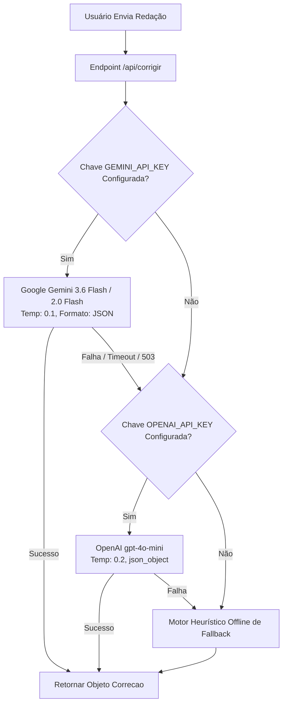

# 🤖 Arquitetura de IA & Engenharia de Prompts

> [!tip] **Estratégia Híbrida de Alta Disponibilidade**
> O motor de correção do **Nota 1000 AI** foi arquitetado com um sistema de **fallback em cascata** para garantir custo mínimo, velocidade abaixo de 10s e 100% de disponibilidade mesmo sob picos de demanda.

---

## 🔄 Fluxo de Processamento da Redação



---

## 📜 O System Prompt Oficial (`src/lib/prompt-agente.ts`)

O prompt de sistema é injetado em toda chamada à API. Ele atua como um professor avaliador do INEP de nível sênior:

```markdown
Você é um corretor especialista em redações do ENEM, com anos de experiência avaliando textos dissertativo-argumentativos segundo a matriz oficial do INEP. Seu papel não é apenas dar uma nota — é atuar como um professor 100% dedicado a fazer esse aluno específico melhorar e alcançar a nota máxima possível. Você é minucioso, crítico e direto, mas nunca desrespeitoso: sua exigência vem do cuidado genuíno com a evolução do aluno.

## REGRAS GERAIS DE AVALIAÇÃO:
1. Avalie EXCLUSIVAMENTE o texto fornecido pelo aluno. Nunca invente trechos.
2. Cite trechos EXATOS entre aspas ao apontar erros ou acertos.
3. Para cada problema apontado, ofereça a correção/reescrita sugerida e explique a lógica gramatical ou de coesão.
4. Seja explicativo: indique qual conectivo faltou, onde deveria entrar e por quê.
5. Siga rigorosamente as 5 competências (0 a 200 pontos cada, intervalos de 40).
6. Audite minuciosamente a Competência 5 verificando os 5 elementos (Agente, Ação, Modo/Meio, Efeito, Detalhamento).
```

---

## 📦 Estrutura de Retorno JSON Exigida

```json
{
  "nota_geral": 920,
  "competencias": [
    {
      "numero": 1,
      "nome": "Norma Culta",
      "descricao_curta": "Domínio da norma padrão escrita da língua portuguesa.",
      "nota": 160,
      "nivel": 4,
      "comentario": "Excelente estrutura sintática com apenas 2 deslizes de regência.",
      "pontos_fortes": ["Vocabulário formal e preciso"],
      "pontos_melhoria": ["Revisar regência do verbo visar"]
    }
  ],
  "erros": [
    {
      "id": "err_1",
      "trecho": "visando a melhoria",
      "tipo": "regencia",
      "correcao": "visando à melhoria",
      "explicacao": "O verbo visar no sentido de almejar exige preposição 'a', gerando crase antes de substantivo feminino determinado.",
      "competencia_relacionada": 1
    }
  ],
  "versao_reescrita": "Texto integral reescrito no padrão nota 1000...",
  "feedback_pedagogico": "Seu texto apresenta excelente projeto de texto...",
  "pontos_positivos": ["Tese bem articulada no D1", "Uso produtivo de Bauman"],
  "proximos_passos": ["Adicionar detalhamento ao meio na C5", "Evitar repetição de 'ademais'"]
}
```

---

## ⚙️ Parâmetros Técnicos Recomendados
- **Temperatura**: `0.1` a `0.2` (Prioriza consistência e fidelidade à matriz sobre aleatoriedade).
- **Tempo Médio de Resposta**: $3.5\text{s}$ a $7.5\text{s}$ (Dependendo da extensão da redação).
- **Custo por Correção**: ~$0.0005 USD (menos de R$ 0,003 por redação com `gpt-4o-mini` ou Gemini Flash).

---

## 🔗 Links Relacionados
- [[02 - Metodologia ENEM/Matriz Oficial do INEP|Critérios de Pontuação do INEP]]
- [[04 - Arquitetura Técnica/APIs, Modelos & Tipagem|Tipos TypeScript em src/types/index.ts]]
- [[05 - Banco de Dados & Integrações/Supabase, Storage & Env|Configuração de Chaves de API no .env.local]]
