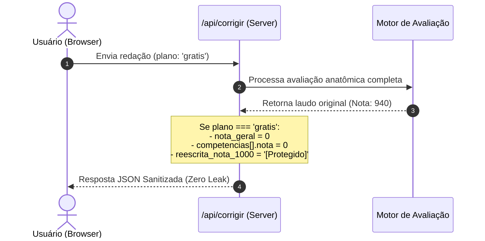

# 🛡️ Arquitetura de Segurança & Blindagem Server-Side (Zero-Leak)

> [!important] **Princípio da Confiança Zero no Client**
> Nenhum dado confidencial (nota oficial do aluno, notas detalhadas de competência ou reescrita padrão 1000) deve ser enviado ao navegador para usuários do plano gratuito. O frontend nunca deve ser o responsável por "esconder" a nota, pois qualquer usuário com o Inspecionar Elemento (F12) conseguiria recuperar o valor.

---

## 📌 1. Por que CSS Blur e Hidden Falham?

Em aplicações ingênuas, o servidor retorna o JSON completo:
```json
{ "nota_geral": 920, "c1": 180, "reescrita": "Texto completo..." }
```
E o React renderiza:
```tsx
<div style={{ filter: isPago ? 'none' : 'blur(10px)' }}>
  {nota_geral}
</div>
```
**Vulnerabilidade**: O usuário abre o DevTools (<kbd>F12</kbd>), remove a classe de `blur` ou inspeciona a aba **Network** e obtém a nota sem pagar.

---

## 📌 2. A Solução Implementada: Sanitização no Backend

No NOTA 1000 PRO, a blindagem ocorre **estritamente antes da resposta HTTP** nos endpoints da API Next.js:



### Código de Sanitização em `/api/corrigir/route.ts`:
```typescript
if (planoUsuario !== 'pro' && planoUsuario !== 'medicina') {
  correcaoSanitizada = {
    ...correcaoCompleta,
    nota_geral: 0,
    competencias: correcaoCompleta.competencias.map(c => ({
      ...c,
      nota: 0,
      justificativa: '[Disponível no Plano PRO]',
    })),
    reescrita_nota_1000: '🔒 A versão reescrita completa está disponível no Plano PRO.',
    is_redacted: true,
  };
}
```

---

## 📌 3. Fluxo de Desbloqueio Seguro (`/api/desbloquear`)

Quando o usuário assina o plano PRO ou confirma o pagamento via PIX:
1. O client envia `{ tema, titulo, texto }` para `/api/desbloquear`.
2. O servidor valida a requisição e retorna o laudo **100% integral**.
3. O client salva a versão completa e atualiza a interface com confetes e notas reveladas.

---

## 📌 4. Mascaração no DOM (Blindagem Total)

Nas páginas [[04 - Arquitetura Técnica/Componentes & Design System|CorrecaoView]], `/dashboard` e `/historico`:
- Se a nota for `0` ou `!planoAtivo`, o DOM renderiza o caractere de substituição `••••` e nunca números.
- Não existem atributos `data-nota="920"` ou estilos reversíveis pelo inspetor.
